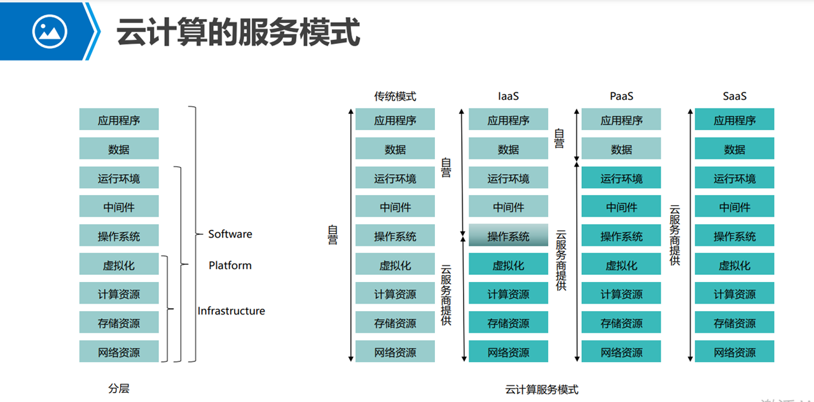

云计算

[TOC]

# 云计算概述

## 云计算的定义

云计算是一种模型,它可以实现随时随地地、便捷地、随需应变地从可配置计算资源共享池中获取所需的资源（例如，网络、存储、应用及服务），资源能够快速供应并释放，使管理资源的工作量和服务提供商的交互减小到最低限度。

## 云计算的历史

1. 云计算1.0——计算虚拟化
   - 虚拟化，更好的资源利用率
2. 云计算2.0——然间整合与定义
   - 基础设施云化，资源服务标准化、自动化
3. 云计算3.0——云原生重构业务
   - 应用云化，敏捷应用开发与生命周期管理

## 云计算的模式

1. 部署模式
   - 公有云
   - 私有云
   - 混合云
   - 行业云
2. 服务模式
   1. **IaaS**：Infrastructure-as-a-Service   基础设施即服务
      是指把IT基础设施作为一种服务通过网络对外提供，并根据用户对资源的实际使用量或占用量进行计费的一种服务模式。在这种服务模型中，普通用户不用自己构建一个数据中心等硬件设施，而是通过租用的方式，利用 Internet从IaaS服务提供商获得计算机基础设施服务，包括服务器、存储和网络等服务
   2. **PaaS**： Platform-as-a-Service      平台即服务
      平台即服务 消除了企业对底层基础设施（一般是硬件和操作系统）的管理需要，让您可以将更多精力放在应用程序的部署和管理上面。这有助于提高效率，因为您不用操心资源购置、容量规划、系统维护、补丁安装或与应用程序运行有关的繁重工作
   3. **SaaS**： Software-as-a-Service            软件即服务
      是一种通过Internet提供软件的模式，用户不用再购买软件，而改用向提供商租用基于web的软件，来管理企业经营活动，且无需对软件进行维护，服务提供商会全权管理和维护软件

## 云计算的案例

1. 网盘
2. 云音乐
3. 备用
4. 交通实时拥堵状况
5. ……

## 云计算的优势

1. 按需自主服务
2. 广泛的网络接入
3. 资源池化
4. 快速弹性收缩
5. 可计量服务