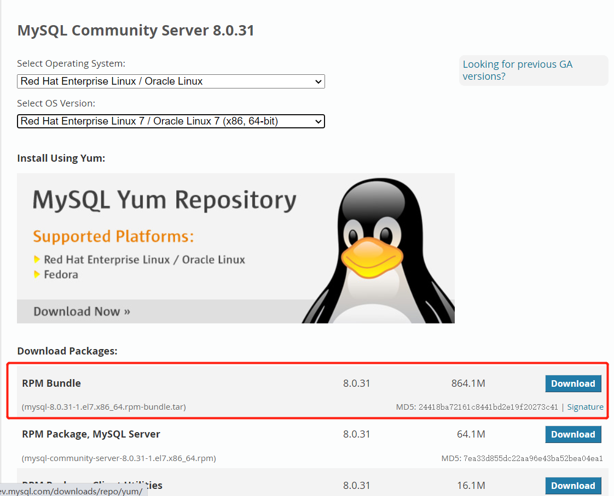

# 虚拟机操作手册

[TOC]


# Cent OS 7常用命令

## 系统命令

| 命令                                               | 说明                                         |
| -------------------------------------------------- | -------------------------------------------- |
| **su**                                             | 切换到root权限（与su有区别）                 |
| **shutdown -h now**                                | 关机                                         |
| **shutdown -r now**                                | 重启                                         |
| **top**                                            | 列出使用CPU资源最多的linux任务 （输入q退出） |
| **pstree**                                         | 以树状图显示程序                             |
| **man ping**                                       | 查看参考手册（例如ping 命令）                |
| **passwd**                                         | 修改密码                                     |
| **df -h**                                          | 显示磁盘的使用情况                           |
| **cal -3**                                         | 显示前一个月，当前月以及下一个月的月历       |
| **cal 4 1994**                                     | 显示指定月，年的月历（当前显示 1994年4月）   |
| **date –date ‘1970-01-01 UTC 1427888888 seconds’** | 把一相对于1970-01-01 00:00的秒数转换成时间   |

## 网络命令

| 命令                                                | 说明                   |
| --------------------------------------------------- | ---------------------- |
| **ifconfig eth0**                                   | 显示一个以太网卡的配置 |
| **iwconfig eth1**                                   | 显示一个无线网卡的配置 |
| **ifconfig eth0 192.168.1.1 netmask 255.255.255.0** | 配置网卡的IP地址       |
| **iwlist scan**                                     | 显示无线网络           |
| **ifdown eth0**                                     | 禁用 ‘eth0’ 网络设备   |
| **ip addr show**                                    | 显示网卡的IP地址       |
| **ifup eth0**                                       | 启用 ‘eth0’ 网络设备   |

## 文件目录

| 命令                    | 说明                                                         |
| ----------------------- | ------------------------------------------------------------ |
| **cd /home**            | 进入 ‘/home’ 目录                                            |
| **cd ..**               | 返回上一级目录                                               |
| **cd ../..**            | 返回上两级目录                                               |
| **cd –**                | 返回上次所在目录                                             |
| **cp file1 file2**      | 将file1复制为file2                                           |
| **cp -a dir1 dir2**     | 复制一个目录                                                 |
| **cp -a /tmp/dir1 .**   | 复制一个目录到当前工作目录（.代表当前目录）                  |
| **ls**                  | 查看目录中的文件                                             |
| **ls -a**               | 显示隐藏文件                                                 |
| **ls -l**               | 显示详细信息                                                 |
| **ls -lrt**             | 按时间显示文件（l表示详细列表，r表示反向排序，t表示按时间排序） |
| **pwd**                 | 显示工作路径                                                 |
| **mkdir dir1**          | 创建 ‘dir1’ 目录                                             |
| **mkdir dir1 dir2**     | 同时创建两个目录                                             |
| mkdir -p /tmp/dir1/dir2 | 创建一个目录树                                               |
| **mv dir1 dir2**        | 移动/重命名一个目录                                          |
| **rm -f file1**         | 删除 ‘file1’                                                 |
| **rm -rf dir1**         | 删除 ‘dir1’ 目录及其子目录内容                               |

- **cd **是 change directory 的缩写，改变当前所在路径。
- **ls **是 list 的缩写，查看文件目录的属性。
- **pwd **是 print working directory 缩写，显示当前所在路径。
- **mv **是 move 缩写，移动文件或者文件夹，也可以用来更改文件名
- **mv file / **把文件file移动到根目录中
- **mv file file_test **把文件file重命名为file_test
- **rm **是 remove缩写，删除目录
- **rm ‐f ‐‐force  **强制删除，不询问是否要删除
- **rm ‐r ‐‐recursive **递归删除，包括文件夹中的内容

## 文本内容处理

| 命令                     | 说明                                       |
| ------------------------ | ------------------------------------------ |
| **grep str /tmp/test**   | 在文件 ‘/tmp/test’ 中查找 “str”            |
| **grep ^str /tmp/test**  | 在文件 ‘/tmp/test’ 中查找以 “str” 开始的行 |
| **grep [0-9] /tmp/test** | 查找 ‘/tmp/test’ 文件中所有包含数字的行    |
| **grep str -r /tmp/\***  | 在目录 ‘/tmp’ 及其子目录中查找 “str”       |
| **diff file1 file2**     | 找出两个文件的不同处                       |
| **sdiff file1 file2**    | 以对比的方式显示两个文件的不同             |
| **vi file i**            | 进入编辑文本模式                           |
| **vi file Esc**          | 退出编辑文本模式                           |
| **vi file :w**           | 保存当前修改                               |
| **vi file :q**           | 不保存退出vi                               |

- **grep** 命令是 搜索内容中是否包含指定的字符串，并打印该行。
- **grep ‐i  ‐‐ignore‐case**  忽略字符大小写的差别
- **grep ‐v** 输出没有指定字符串的文件
- **grep ‐c** 只输出匹配行的计数
- **grep ‐R** 连同子目录中所有文件一起查找

## 查看文件

| 命令              | 说明                                 |
| ----------------- | ------------------------------------ |
| **cat file1**     | 从第一个字节开始正向查看文件的内容   |
| **head -2 file1** | 查看一个文件的前两行                 |
| **more file1**    | 查看一个长文件的内容                 |
| **tac file1**     | 从最后一行开始反向查看一个文件的内容 |
| **tail -3 file1** | 查看一个文件的最后三行               |
| **vi file**       | 打开并浏览文件                       |

- **cat** 是 concatenate 缩写，用来查看文件内容，以及将几个文件连成一个文件。
- **cat file1 file2 > file3** 将文件file1 file2连成file3文件
- **more** 是最常用的工具之一，用来显示输出的内容，根据窗口的大小进行分页显示，并且提示文件的百分比。
- **more +num**  从第num行开始显示
- **more ‐num**  定义每屏显示num行

## 查询

| 命令                                                 | 说明                                             |
| ---------------------------------------------------- | ------------------------------------------------ |
| **find / -name file1**                               | 从 ‘/’ 开始进入根文件系统查找文件和目录          |
| **find / -user user1**                               | 查找属于用户 ‘user1’ 的文件和目录                |
| **find /home/user1 -name \*.bin**                    | 在目录 ‘/ home/user1’ 中查找以 ‘.bin’ 结尾的文件 |
| **find /usr/bin -type f -atime +100**                | 查找在过去100天内未被使用过的执行文件            |
| **find /usr/bin -type f -mtime -10**                 | 查找在10天内被创建或者修改过的文件               |
| **locate \*.ps**                                     | 寻找以 ‘.ps’ 结尾的文件，先运行 ‘updatedb’ 命令  |
| **find -name ‘\*.[ch]’ \| xargs grep -E ‘expr’**     | 在当前目录及其子目录所有.c和.h文件中查找 ‘expr’  |
| **find -type f -print0 \| xargs -r0 grep -F ‘expr’** | 在当前目录及其子目录的常规文件中查找 ‘expr’      |
| **find -maxdepth 1 -type f \| xargs grep -F ‘expr’** | 在当前目录中查找 ‘expr’                          |

1. **find**命令 直接在全文件系统上搜寻，功能强大，速度慢。使用格式：
   1. **find [path] [‐option] [ ‐print ‐exec ‐ok command ] {} \ **;
2. **path** 要执行查找的目录
   1. **‐option** 查找的具体方法
   2. **‐print find** 命令将匹配的文件输出到标准输出
   3. **‐exec find** 命令对匹配的文件执行该参数所给出的shell命令。相应命令的形式为’command’ {} \;，注意{}和\；之间的空格
   4. **‐ok** **和‐exec** 的作用相同，只不过以一种更为安全的模式来执行该参数所给出的shell命令，在执行每一个命令之前，都会给出提示，让用户来确定是否执行。

## 压缩、解压

| 命令                                | 说明                                                         |
| ----------------------------------- | ------------------------------------------------------------ |
| **bzip2 file1**                     | 压缩 file1                                                   |
| **bunzip2 file1.bz2**               | 解压 file1.bz2                                               |
| **gzip file1**                      | 压缩 file1                                                   |
| **gzip -9 file1**                   | 最大程度压缩 file1                                           |
| **gunzip file1.gz**                 | 解压 file1.gz                                                |
| **tar -cvf archive.tar file1**      | 把file1打包成 archive.tar（-c: 建立压缩档案；-v: 显示所有过程； -f: 使用档案名字，是必须的，是最后一个参数） |
| **tar -cvf archive.tar file1 dir1** | 把 file1，dir1 打包成 archive.tar                            |
| **tar -tf archive.tar**             | 显示一个包中的内容                                           |
| **tar -xvf archive.tar**            | 释放一个包                                                   |
| **tar -xvf archive.tar -C /tmp**    | 把压缩包释放到 /tmp目录下                                    |
| **zip file1.zip file1**             | 创建一个zip格式的压缩包                                      |
| **zip -r file1.zip file1 dir1**     | 把文件和目录压缩成一个zip格式的压缩包                        |
| **unzip file1.zip**                 | 解压一个zip格式的压缩包到当前目录                            |
| **unzip test.zip -d /tmp/**         | 解压一个zip格式的压缩包到 /tmp 目录                          |

## yum安装器

| 命令                               | 说明                                                |
| ---------------------------------- | --------------------------------------------------- |
| **yum -y install [package]**       | 下载并安装一个rpm包                                 |
| **yum localinstall [package.rpm]** | 安装一个rpm包，使用你自己的软件仓库解决所有依赖关系 |
| **yum -y update**                  | 更新当前系统中安装的所有rpm包                       |
| **yum update [package]**           | 更新一个rpm包                                       |
| **yum remove [package]**           | 删除一个rpm包                                       |
| **yum list**                       | 列出当前系统中安装的所有包                          |
| **yum search [package]**           | 在rpm仓库中搜寻软件包                               |
| **yum clean [package]**            | 清除缓存目录（/var/cache/yum）下的软件包            |
| **yum clean headers**              | 删除所有头文件                                      |
| **yum clean all**                  | 删除所有缓存的包和头文件                            |

## systemctl命令

```sh
# 开机运行服务：
systemctl enable *.service
# 取消开机运行
systemctl disable *.service
# 启动服务
systemctl start *.service
# 停止服务
systemctl stop *.service
# 重启服务
systemctl restart *.service
# 重新加载服务配置文件
systemctl reload *.service
# 查询服务运行状态
systemctl status *.service
# 显示启动失败的服务
systemctl --failed
```

## 防火墙命令

```sh
# 开启防火墙
systemctl start firewalld
# 查看版本：
firewall-cmd --version
# 查看帮助：
firewall-cmd --help
# 显示状态：
firewall-cmd --state
# 查看端口：
firewall-cmd --list-port
# 开放端口：
firewall-cmd --add-port=80/tcp --permanent
firewall-cmd --add-port=20000-20010/tcp --permanent
# 禁用端口：
firewall-cmd --remove-port=80/tcp --permanent
firewall-cmd --remove-port=20000-20010/tcp --permanent
# 查看端口号是否开放成功，输出yes开放成功，no则失败
firewall-cmd --zone=public --query-port=27017/tcp

# 重新加载防火墙规则：
firewall-cmd --reload

# 开放/关闭服务端口：
# 打开FTP服务：
firewall-cmd --add-service=ftp --permanent
# 关闭FTP服务：
firewall-cmd --remove-service=ftp --permanent

## 参数 --permanent，表示永久生效
```

## 权限设置命令

Linux 系统中，文件的基本权限由 9 个字符组成，以 rwxrw-r-x 为例，我们可以使用数字来代表各个权限，各个权限与数字的对应关系如下：

```sh
r --> 4
w --> 2
x --> 1
```

由于这 9 个字符分属 3 类用户，因此每种用户身份包含 3 个权限（r、w、x），通过将 3 个权限对应的数字累加，最终得到的值即可作为每种用户所具有的权限。

拿 rwxrw-r-x 来说，所有者、所属组和其他人分别对应的权限值为：

```sh
所有者 = rwx = 4+2+1 = 7
所属组 = rw- = 4+2 = 6
其他人 = r-x = 4+1 = 5
```

所以，此权限对应的权限值就是 765。

```sh
chmod [-R] 权限值 文件名
```

-R（注意是大写）选项表示连同子目录中的所有文件，也都修改设定的权限。

## 写入空白到文件

```sh
cd /data1/tomcat8/tomcat/log
echo -n  " " > catalina.out
```

# CentOS 7虚拟机部署操作

## 修改网卡

1. 查看所有网卡信息

   ```sh
   ip a
   ```

   如下：

   ```sh
   1: lo: <LOOPBACK,UP,LOWER_UP> mtu 65536 qdisc noqueue state UNKNOWN group default qlen 1000
       link/loopback 00:00:00:00:00:00 brd 00:00:00:00:00:00
       inet 127.0.0.1/8 scope host lo
          valid_lft forever preferred_lft forever
       inet6 ::1/128 scope host 
          valid_lft forever preferred_lft forever
   2: ens33: <BROADCAST,MULTICAST,UP,LOWER_UP> mtu 1500 qdisc pfifo_fast state UP group default qlen 1000  link/ether 00:0c:29:46:fa:ef brd  ff:ff:ff:ff:ff:ff
       inet 192.168.220.129/24 brd 192.168.220.255 scope global noprefixroute dynamic ens33
          valid_lft 1348sec preferred_lft 1348sec
       inet6 fe80::20bd:8254:8e89:8a50/64 scope link noprefixroute 
          valid_lft forever preferred_lft forever
   ```

   这里以第二张网卡`ens33`进行示例

2. 修改对应网卡配置文件

   ```sh
   vi /etc/sysconfig/network-scripts/ifcfg-ens33
   ```

   内容如下

   ```sh
   TYPE=Ethernet
   PROXY_METHOD=none
   BROWSER_ONLY=no
   BOOTPROTO=dhcp
   DEFROUTE=yes
   IPV4_FAILURE_FATAL=no
   IPV6INIT=yes
   IPV6_AUTOCONF=yes
   IPV6_DEFROUTE=yes
   IPV6_FAILURE_FATAL=no
   IPV6_ADDR_GEN_MODE=stable-privacy
   NAME=ens33
   UUID=fd92ff57-ba9a-41c9-8545-0f61c519ba0c
   DEVICE=ens33
   ONBOOT=no
   ```

   修改下列两个选项

   ```sh
   BOOTPROTO=static
   ONBOOT=yes
   ```

   并在后面添加如下内容(以下内容根据自己网络情况配置)

   ```sh
   IPADDR=192.168.220.129
   NETMARSK=255.255.255.0
   GATEWAY=192.168.220.2
   DNS1=114.114.114.114
   DNS2=8.8.8.8 
   ```
   
   
   
3. 重启网络服务

   ```sh
   systemctl restart network
   ```

4. 测试是否配置成功

   ```sh
   ip a
   ```

## 更换yum源

**yum源的默认仓库文件夹是 `/etc/yum.repos.d/`，只有在这个目录`第一层`的\*.repo结尾的文件，才会被yum读取**

1. 下载[wget](https://so.csdn.net/so/search?q=wget&spm=1001.2101.3001.7020)命令

   ```sh
   yum install wget -y    # wget命令就是在线下载一个url的静态资源
   ```

   

2. 备份旧的[yum](https://so.csdn.net/so/search?q=yum&spm=1001.2101.3001.7020)仓库源

   ```sh
   cd  /etc/yum.repos.d
   mkdir  repobak  # 创建文件夹，保存备份文件
   mv *.repo   repobak  #备份repo文件到文件
   ```

3. 清理旧包

   ```sh
   yum clean all
   ```

4. 下载新的阿里的yum源仓库

   阿里的开源镜像：`https://developer.aliyun.com/mirror/`

   ```sh
   wget -O /etc/yum.repos.d/CentOS-Base.repo http://mirrors.aliyun.com/repo/Centos-7.repo
   ```

5. 继续下载第二个仓库 epel仓库

   ```sh
   wget -O /etc/yum.repos.d/epel.repo http://mirrors.aliyun.com/repo/epel-7.repo
   ```

6. 此时已经配置完毕，2个新的yum仓库，可以下载软件

   ```sh
   [root@s25linux yum.repos.d]# ls
   CentOS-Base.repo  epel.repo  repobak
   ```

7. 生成yum源缓存并更新yum源

   ```sh
   yum makecache
   yum update
   ```
   
   

## 虚拟机安装tools

1. 虚拟机管理平台挂载tools

2. 创建挂在文件夹

   ```sh
   mkdir /root/nmt/
   ```

3. 挂载镜像至刚才创建的文件夹下

   ```sh
   mount /dev/sr0 /root/nmt/
   ```

4. 查看挂载文件

   ```sh
   cd /root/nmt/
   ls
   ```

   

   内容如下

   ```sh
   manifest.txt     VMwareTools-10.3.10-13959562.tar.gz  vmware-tools-upgrader-64
   run_upgrader.sh  vmware-tools-upgrader-32
   ```

5. 将安装包复制到该文件夹`/root/`下

   ```sh
   cp VMwareTools-10.3.10-13959562.tar.gz /root/
   ```

6. 进入`/root/`文件夹下解压文件

   ```sh
   cd /root/
   tar -zxvf VMwareTools-10.3.10-13959562.tar.gz
   # 若为Fusion Compute平台则使用下面命令解压文件
   # tar -xjvf vmtools……
   ```

   解压报错建议更新yum源并安装tar包

   ```SH
   yum update
   yum -y install tar
   yum -y install perl
   yum -y install bzip2
   ```

7. 解压目录并安装

   ```sh
   cd .. 
   cd vmware-tools-distrib
   sudo ./vmware-install.pl
   ```

8. 重启电脑即可

## 修改ssh端口

1. 编辑ssh配置文件

   ```sh
   vi /etc/ssh/sshd_config
   ```

   

2. 修改端口

   ```sh
   Port 222 # 这里修改成自己设置的端口
   #Port 22
   ```

3. 添加ssh监听端口

   ```sh
   semanage port -a -t ssh_port_t -p tcp 222
   ```

   若报错，安装policycoreutils-python软件包

   ```sh
   yum install policycoreutils-python -y
   ```

   安装完成再次执行添加ssh监听端口

4. 查看端口是否添加成功

   ```sh
   semanage port -l|grep ssh
   ```

   结果如下

   ```sh
   ssh_port_t                     tcp      222, 22
   ```

   

5. 将刚才修改的端口添加到防火墙规则

   ```sh
   firewall-cmd --zone=public --add-port=222/tcp --permanent  # 这里222修改成自己设置的端口
   ```

6. 重新加载防火墙策略

   ```sh
   firewall-cmd --reload
   ```

7. 重启SSH服务和防火墙，最好也重启下服务器：

  ```sh
systemctl restart sshd
systemctl restart firewalld.service
shutdown -r now
  ```

8. 重新ssh连接测试

# CentOS 7 常用软件安装

## 基本命令

```sh
clear    |清屏|
pwd    |显示当前路径|
more    |显示文本文档|
uname -a    |查看当前核心版本号|
free    |查看剩余内存|
df -h    |[查看磁盘剩余空间]|
du -sh <dir>    |查看文件夹名"dir"占用的空间|
lsof -i:8080    |查看8080端口是否被占用|
find . -name "filename.txt"    |搜索当前目录下filename.txt文件，包括各级子目录|
groupadd abc    |创建一个名为abc的用户组|
useradd -g abc abc    |在abc组里添加一个名为abc的用户|
chown sammy ~/dir    |将目录dir的拥有者设为用户sammy|
cut -d : -f 1 /etc/passwd    |查看所有用户|
cat /etc/grou    |查看所有用户组|
tail -n 20 filename    |显示filename最后20行|
chmod -R 777 dir    |将目录dir整体变为777|
rm -rf dir    |整体删除dir|
cp -r -a ./* /dir    |将当前路径下所有文件包括子目录全部拷贝到dir|
tar -xvzf filename    |解压缩gz文件|
gzip -d filename    |解压缩gz文件|
unzip -x filename    |解压缩zip文件|
zip -r filename.zip ./*    |压缩当前目录下全部内容|
rpm -ivh filename    |安装一个包|
rpm -Uvh filename    |升级一个包|
rpm -e <filename>    |卸载一个包|
nohup cmds >/dev/null 2>&1 &    |无任何输出或log，在后台运行一个cmds指令|
```


## 前置操作

1. 系统安装部署

2. ip设置

3. 换源
   如果阿里源出错，可换成网易源

   ```sh
   sudo wget -O /etc/yum.repos.d/CentOS-Base.repo http://mirrors.163.com/.help/CentOS7-Base-163.repo
   ```

4. 更新

   ```sh
   # 刷新缓存
   sudo yum makecache
   sudo yum -y update
   sudo yum -y upgrade
   ```

## 安装Aapache:

```sh
# 安装
yum install httpd.x86_64 
# 启动
systemctl start httpd.service 
# 自启
systemctl enable httpd.service
```

> 然后到浏览器那边测试一下：http://服务器ip
>
> 会出现一个Testing 1.2.3的测试页。
>
> Apache的主页默认路径： /var/www/html/
>
> Apache的主设置文件路径：/etc/httpd/conf/httpd.conf
>
> 如果打不开尝试放开80端口后，再次刷新网页即可。

```sh
firewall-cmd --zone=public --add-port=80/tcp --permanent
firewall-cmd --reload
systemctl restart firewalld.service
```


## 安装MySQL8

1. 卸载mariadb

   > mariadb 这个是 Linux 系统自带的数据库系统，跟 MySQL 冲突，所以一般先卸载这个没用的数据库。

   查看 mariadb

   ```sh
   rpm -qa | grep mariadb
   ```

   结果如下：

   ```sh
   mariadb-libs-5.5.68-1.el7.x86_64
   ```

   

   卸载

   ```sh
   rpm -ev --nodeps mariadb-libs-5.5.68-1.el7.x86_64
   ```

   

2. 下载MySQL

   - 官网下载

     > 官网地址：[https://dev.mysql.com/downloads/mysql](https://links.jianshu.com/go?to=https%3A%2F%2Fdev.mysql.com%2Fdownloads%2Fmysql)
     >
     > 

     

   - wget下载

     ```sh
     wget https://downloads.mysql.com/archives/get/p/23/file/mysql-8.0.22-1.el7.x86_64.rpm-bundle.tar
     ```

     

3. 安装MySQL

   > 创建安装目录并上传下载好的包到安装目录(/usr/local/mysql)解压

   ```sh
   cd /usr/local/
   mkdir mysql
   cd mysql
   ll
   # mysql-8.0.22-1.el7.x86_64.rpm-bundle.tar
   
   # 如果没有下载的下载,以下载或上传至此文件夹的不用执行下一步
   wget https://downloads.mysql.com/archives/get/p/23/file/mysql-8.0.22-1.el7.x86_64.rpm-bundle.tar
   
   tar -xvf mysql-8.0.22-1.el7.x86_64.rpm-bundle.tar
   
   # mysql-community-client-8.0.22-1.el7.x86_64.rpm
   # mysql-community-client-plugins-8.0.22-1.el7.x86_64.rpm
   # mysql-community-common-8.0.22-1.el7.x86_64.rpm
   # mysql-community-devel-8.0.22-1.el7.x86_64.rpm
   # mysql-community-embedded-compat-8.0.22-1.el7.x86_64.rpm
   # mysql-community-libs-8.0.22-1.el7.x86_64.rpm
   # mysql-community-libs-compat-8.0.22-1.el7.x86_64.rpm
   # mysql-community-server-8.0.22-1.el7.x86_64.rpm
   # mysql-community-test-8.0.22-1.el7.x86_64.rpm
   ```

   > 注意：需要按照以下安装顺序进行安装，否则会出问题
   >  安装顺序：COMMON  -->  LIB  -->  LIB-COMPAT  -->  CLIENT  --> SERVER
   >  依次执行以下命令，提示100%字样表示安装成功

   ```sh
   rpm -ivh mysql-community-common-8.0.22-1.el7.x86_64.rpm --nodeps --force
   rpm -ivh mysql-community-libs-8.0.22-1.el7.x86_64.rpm --nodeps --force
   rpm -ivh mysql-community-libs-compat-8.0.22-1.el7.x86_64.rpm --nodeps --force
   rpm -ivh mysql-community-client-8.0.22-1.el7.x86_64.rpm --nodeps --force
   rpm -ivh mysql-community-server-8.0.22-1.el7.x86_64.rpm --nodeps --force
   
   rpm -qa | grep mysql
   # mysql-community-libs-8.0.22-1.el7.x86_64
   # mysql-community-common-8.0.22-1.el7.x86_64
   # mysql-community-libs-compat-8.0.22-1.el7.x86_64
   # mysql-community-server-8.0.22-1.el7.x86_64
   # mysql-community-client-8.0.22-1.el7.x86_64
   ```

   

4. 初始化

   ```sh
   mysqld --initialize;
   chown mysql:mysql /var/lib/mysql -R;
   systemctl start mysqld.service;
   systemctl enable mysqld;
   ```

5. 修改MySQL密码

   查看数据库默认随记密码

   ```sh
   cat /var/log/mysqld.log | grep password
   ```

   使用随记密码登录 MySQL

   ```sh
   mysql -uroot -p
   ```

   修改 MySQL 密码,“yourPassword” 记得修改为自己的密码

   ```mysql
   ALTER USER 'root'@'localhost' IDENTIFIED WITH mysql_native_password BY 'yourPassword';
   ```

6. 设置远程登录

   选择mysql数据库

   ```mysql
   use mysql;
   ```

   修改user表使其root用户可以通过远程连接

   ```mysql
   update user set host = '%' where user = 'root';
   ```

   刷新权限并退出

   ```mysql
   flush privileges;
   \q;
   ```

   

7. 开放防火墙端口

   开放端口进行远程链接

   ```sh
   firewall-cmd --zone=public --add-port=3306/tcp --permanent
   
   firewall-cmd --reload
   ```

   查看开放端口

   ```sh
   firewall-cmd --list-ports
   ```

8. 测试连接是否正常

   ```sh
   mysql -uroot -p -h 192.168.220.2  # 192.168.220.2 修改为该主机ip
   ```

   

# Windows

## 修改远程桌面端口

1. **方法一**
   通过远程桌面客户端连接到计算机（Windows 客户端或 Windows Server）时，计算机上的远程桌面功能会通过定义的侦听端口（默认情况下为 3389）“侦听”连接请求。 可以通过修改注册表来更改 Windows 计算机上的侦听端口。

   1. 启动注册表编辑器。 （在“搜索”框中键入 regedit。）
   2. 导航到以下注册表子项：**HKEY_LOCAL_MACHINE\System\CurrentControlSet\Control\Terminal Server\WinStations\RDP-Tcp**
   3. 查找端口号
   4. 单击“编辑”“修改”，然后单击“十进制”。
   5. 键入新端口号，然后单击“确定” 。
   6. 关闭注册表编辑器，然后重新启动计算机。

2. **方法二**

   1. 可运行以下 PowerShell 命令(以管理员方式)来查看当前端口：

      ```powershell
      Get-ItemProperty -Path 'HKLM:\SYSTEM\CurrentControlSet\Control\Terminal Server\WinStations\RDP-Tcp' -name "PortNumber"
      ```

      例如：

      ```powershell
      PortNumber   : 3389
      PSPath       : Microsoft.PowerShell.Core\Registry::HKEY_LOCAL_MACHINE\SYSTEM\CurrentControlSet\Control\Terminal Server\WinStations\RDP-Tcp
      PSParentPath : Microsoft.PowerShell.Core\Registry::HKEY_LOCAL_MACHINE\SYSTEM\CurrentControlSet\Control\Terminal Server\WinStations
      PSChildName  : RDP-Tcp
      PSDrive      : HKLM
      PSProvider   : Microsoft.PowerShell.Core\Registry
      ```

   2. 还可运行以下 PowerShell 命令来更改 RDP 端口。 在此命令中，我们会将新的 RDP 端口指定为 53389。

      若要向注册表添加新的 RDP 端口：

      ```powershell
      $portvalue = 53389
      
      Set-ItemProperty -Path 'HKLM:\SYSTEM\CurrentControlSet\Control\Terminal Server\WinStations\RDP-Tcp' -name "PortNumber" -Value $portvalue 
      
      New-NetFirewallRule -DisplayName 'RDPPORTLatest-TCP-In' -Profile 'Public' -Direction Inbound -Action Allow -Protocol TCP -LocalPort $portvalue 
      New-NetFirewallRule -DisplayName 'RDPPORTLatest-UDP-In' -Profile 'Public' -Direction Inbound -Action Allow -Protocol UDP -LocalPort $portvalue
      ```

   3. 重启电脑即可

3. **方法三**

   1. 打开远程
      右键我的电脑——>属性——>启用远程

   2. 使用以下脚本一键修改
      新建bat文件——>复制以下文——>粘贴——>保存——>以管理员方式运行——>按照提示输入自定义端口——>按提示等待完成即可

      ```sh
      @echo off
      
      color f0
      
      echo 修改远程桌面3389端口(支持Windows 2003 2008 2008R2 2012 2012R2 7 8 10 )
      
      echo 自动添加防火墙规则
      
      echo %date%   %time%
      
      echo 建议设置为不常用端口
      
      set /p c= 请输入新的端口:
      
      if "%c%"=="" goto end
      
      goto edit
      
      :edit
      
      netsh advfirewall firewall add rule name="Remote PortNumber" dir=in action=allow protocol=TCP localport="%c%"
      
      netsh advfirewall firewall add rule name="Remote PortNumber" dir=in action=allow protocol=TCP localport="%c%"
      
      reg add "HKEY_LOCAL_MACHINE\SYSTEM\CurrentControlSet\Control\Terminal Server\Wds\rdpwd\Tds\tcp" /v "PortNumber" /t REG_DWORD /d "%c%" /f
      
      reg add "HKEY_LOCAL_MACHINE\SYSTEM\CurrentControlSet\Control\Terminal Server\WinStations\RDP-Tcp" /v "PortNumber" /t REG_DWORD /d "%c%" /f
      
      echo 修改成功
      
      echo 重启后生效，按任意键重启
      
      pause
      
      shutdown /r /t 0
      
      exit
      
      :end
      
      echo 修改失败
      
      pause
      ```

4. **注意**：下次使用远程桌面连接连接到此计算机时，必须键入新端口。 如果正在使用防火墙，请确保将防火墙配置为允许连接到新端口号。